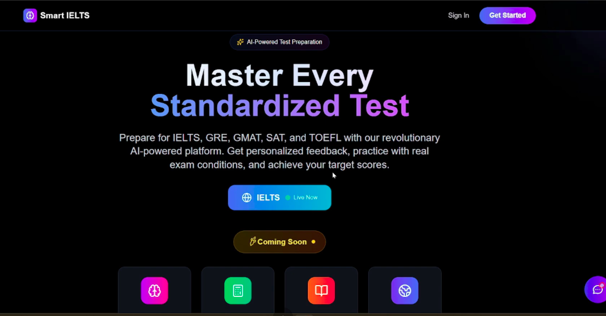

# 🎓 Smart IELTS - AI-Powered Test Preparation Platform

<div align="center">

## 🎥 **Demonstration On Youtube**

[](https://www.youtube.com/watch?v=mgMEFtJPmYY)

**[🎬 Click here to watch the complete project demonstration](https://www.youtube.com/watch?v=mgMEFtJPmYY)**

---


[](https://nextjs.org/)
[](https://nodejs.org/)
[](https://www.typescriptlang.org/)
[](https://smythos.com/)
[](https://opensource.org/licenses/MIT)

**🏆 4th Place Winner - Inter-University National Hackathon 2025**

**An intelligent, comprehensive test preparation platform powered by cutting-edge AI technology**

[🚀 Live Demo](https://smart-ielts.onrender.com) | [🎨 Figma Design](https://www.figma.com/design/FLydtNSPZvmzg1wL2KZA7k/Smart-ILTS-UI?node-id=0-1&t=X9lXbv6Ir1GvVkVS-1) | [📊 Presentation](https://gamma.app/docs/Smart-IELTS-AI-Powered-Exam-Preparation-oiflu0ruio4gt67?mode=doc) | [� GitHub](https://github.com/BadhonAhmad/Smart-IELTS) | [📖 Documentation](#getting-started)

</div>

---

## 🏆 Hackathon Achievement

<div align="center">

### 🎉 **4th Position at Inter-University National Hackathon 2025**
**Green University of Bangladesh • Powered by SmythOS**


</div>

> **Alhamdulillah!** We are super excited to share that our team **SUST_Prompt_Storm** secured **4th position** 🎉 in the **Inter-University National Hackathon 2025** at Green University of Bangladesh, powered by **SmythOS** 🚀

### 🌟 Our Journey
- 📊 Selection Round: Ranked 6th out of ~250 teams
- 🏁 Final Round: Competed among 50 finalist teams
- 🥇 Final Result: Secured 4th position

<div align="center">

| Selection Round | Competition Time | Presentation Day |
|:---------------:|:----------------:|:------------------:|
|  |  |  |

</div>

### 👨‍💻 Team SUST_Prompt_Storm
- [Abhishek Dash](https://www.linkedin.com/in/abhishek-dash-60762322a/) - Team Leader, Frontend Developer & UI/UX
- [Badhon Ahmad](https://www.linkedin.com/in/badhon-ahmad-5a5894225/) - Full Stack Developer & System Architecture
- [Md Ahasanul Haque Sazid](https://www.linkedin.com/in/sksazid/) - Backend Developer & SmythOS Agent Integration

<div align="center">


*Team SUST_Prompt_Storm at the Grand Final*

</div>

### 🌟 What We Learned
- ✅ Effective teamwork under pressure
- ✅ Error handling in tight deadlines
- ✅ Confident project presentation
- ✅ Time management and fast thinking
- ✅ Innovative problem-solving

### 🎯 Competition Highlights
- **Duration**: 48 hours intensive development
- **Theme**: AI-powered educational solutions
- **Technology**: SmythOS, Next.js, Node.js, AI/ML
- **Challenges**: Real-time AI integration, scalable architecture, UX

<div align="center">

| Development Phase | Team Collaboration | Final Demo |
|:-----------------:|:------------------:|:----------:|
|  |  |  |

</div>

---

## 🚀 Current Deployment Status

### 🌐 Live Services Status

| Service | Status | URL | Health Check |
|---------|--------|-----|-------------|
| **Agent Backend** | ✅ **LIVE** | [smart-ielts.onrender.com](https://smart-ielts.onrender.com) | ✅ `/health` |
| **Main Backend** | ⏳ **Pending** | *Next to deploy* | ⏳ Waiting |
| **Frontend** | ✅ **READY** | *Enhanced with SmythOS* | ✅ Complete |

### 🛠️ Available Features
- ✅ **AI Agent Skills**: Email, WebSearch, Document Q&A, PDF Processing, Google Drive
- ✅ **Natural Language Interface**: Advanced conversational AI with SmythOS integration
- ✅ **Document Intelligence**: PDF indexing, semantic search, Q&A from study materials
- ✅ **Smart Document Search**: Vector-based search through IELTS materials
- ✅ **Email Integration**: Send study materials and progress reports
- ✅ **Web Search**: Real-time IELTS information and updates
- ✅ **Google Drive Integration**: PDF backup and organization with metadata
- ✅ **Agent Dashboard**: Real-time monitoring and skill testing
- ✅ **Study Materials Manager**: Complete document management system
- ✅ **Question Assistant**: Intelligent Q&A with source citations
- ✅ **Enhanced Chatbot**: Context-aware responses with multiple skills
- ✅ **RESTful API**: Complete endpoint suite for programmatic access
- ✅ **Vector Database**: Pinecone integration for scalable storage
- ✅ **SmythOS Integration**: Full platform capabilities with MCP protocol
- ⏳ **IELTS Test Modules**: Coming with backend deployment
- ⏳ **User Authentication**: Coming with backend deployment

### 🧪 Test the Agent Now!
```bash
# Test agent health
curl https://smart-ielts.onrender.com/health

# List available skills  
curl https://smart-ielts.onrender.com/api/agent/skills

# Test natural language chat
curl -X POST https://smart-ielts.onrender.com/api/prompt \
  -H "Content-Type: application/json" \
  -d '{"prompt": "Hello! Can you help me with IELTS preparation?"}'

# Send email via agent
curl -X POST https://smart-ielts.onrender.com/api/agent/skills/send_email \
  -H "Content-Type: application/json" \
  -d '{"to": "user@example.com", "subject": "Test", "body": "Hello from AI agent!"}'

# Web search capability
curl -X POST https://smart-ielts.onrender.com/api/agent/skills/WebSearch \
  -H "Content-Type: application/json" \
  -d '{"userQuery": "IELTS preparation tips"}'

# Index a document for Q&A
curl -X POST https://smart-ielts.onrender.com/api/agent/skills/index_document \
  -H "Content-Type: application/json" \
  -d '{"document_path": "ielts-guide.pdf"}'

# Search through indexed documents
curl -X POST https://smart-ielts.onrender.com/api/agent/skills/lookup_document \
  -H "Content-Type: application/json" \
  -d '{"user_query": "What are the IELTS writing task types?"}'
```

---

## 🎨 Frontend SmythOS Integration

### 🚀 Enhanced User Experience
Our frontend features comprehensive SmythOS agent integration with advanced UI components:

#### 🤖 Intelligent Chatbot (`FloatingChatbot.tsx`)
- Smart Intent Detection: Automatically routes queries to appropriate agent skills
- Multi-Modal Responses: Handles document search, web search, email, and Google Drive operations
- Real-time Agent Status: Live connection monitoring with health indicators
- Source Citations: Shows document sources and confidence scores
- Context Awareness: Maintains conversation history and user preferences

#### 📚 Study Materials Manager (`StudyMaterialsManager.tsx`)
- Dual Storage View: Local documents and Google Drive files in one interface
- Smart Search: Semantic search across all indexed materials
- Email Sharing: Send study materials directly to students or groups
- Backup Integration: One-click backup to Google Drive with metadata
- Subject Filtering: Organize by Reading, Writing, Listening, Speaking

#### ❓ Question Assistant (`IELTSQuestionAssistant.tsx`)
- Multi-Search Modes: Smart (documents + web), documents only, or web only
- Intelligent Answers: AI-powered responses from vectorized IELTS materials
- Question History: Save and manage previous Q&A sessions
- Source Tracking: See exactly where answers come from
- Email Q&A: Share questions and answers via email

#### 📊 Agent Dashboard (`AgentDashboard.tsx`)
- Real-time Monitoring: Live agent health and status checking
- Skill Testing: Test all agent capabilities with one click
- Performance Metrics: Response times and success rates
- Test Results Log: Historical performance data
- System Information: Detailed agent configuration and status

### 🛠️ Technical Implementation

#### 🔧 API Service Layer (`agentService.ts`)
```typescript
// Comprehensive SmythOS agent integration
class AgentService {
  // Document Intelligence
  async askIELTSQuestion(question: string)
  async searchDocuments(query: string)
  async indexDocument(path: string)
  
  // Google Drive Integration
  async storePdfToDrive(content: string, filename: string)
  async listDrivePdfs(category?: string)
  
  // Communication
  async sendEmail(emailData: EmailRequest)
  async shareStudyMaterials(materials: string[], emails: string[])
  
  // Web Research
  async webSearch(query: string, filters?: SearchFilters)
  
  // System Management
  async checkHealth()
  async listSkills()
}
```

#### 📱 Demo Page (`/agent-demo`)
- Interactive Showcase: All SmythOS capabilities in one page
- Tabbed Interface: Chat, Materials, Questions, Dashboard
- Subject Filtering: IELTS-specific content organization
- Live Testing: Real-time agent interaction and testing

### 🎯 Usage Examples

#### 💬 Natural Language Queries
```
"Find IELTS writing examples" → Document search with results
"Email practice tests to john@example.com" → Email functionality
"Latest IELTS changes 2025" → Web search with current info
"Show my Google Drive files" → Drive integration
"What are IELTS speaking topics?" → Intelligent Q&A
```

#### 🔧 Direct API Integration
```typescript
// Example component usage
const handleSearch = async () => {
  const result = await agentService.askIELTSQuestion(
    "What are the IELTS writing task types?"
  );
  if (result.success) {
    setAnswer(result.data.answer);
    setSources(result.data.sources);
  }
};
```

### 📊 Advanced Features
- ✅ TypeScript Integration: Full type safety across all components
- ✅ Error Handling: Comprehensive error boundaries and fallbacks
- ✅ Loading States: Smooth UX with proper loading indicators
- ✅ Responsive Design: Mobile-first approach with Tailwind CSS
- ✅ Accessibility: WCAG 2.1 AA compliant components
- ✅ Performance: Optimized with React 18 and Next.js 15
- ✅ Real-time Updates: Live status monitoring and auto-refresh
- ✅ Offline Support: Graceful degradation when agent is unavailable

---

## 🔗 AI Agent API Documentation

### Base URL
- **Production**: `https://smart-ielts.onrender.com`
- **Local Development**: `http://localhost:5000`

### Available Skills

#### 📧 Email Skill
```http
POST /api/agent/skills/send_email
Content-Type: application/json

{
  "to": "recipient@example.com",
  "subject": "IELTS Study Reminder",
  "body": "Don't forget to practice your speaking skills today!",
  "cc": "mentor@example.com"
}
```

#### 🌐 Web Search Skill
```http
POST /api/agent/skills/WebSearch
Content-Type: application/json

{
  "userQuery": "latest IELTS exam format changes 2025"
}
```

#### 📚 Document Processing Skills
```http
# Index a PDF document
POST /api/agent/skills/index_document
{
  "document_path": "data/ielts-preparation-guide.pdf"
}

# Search indexed documents
POST /api/agent/skills/lookup_document
{
  "user_query": "How to improve IELTS writing band score?"
}

# Get document information
POST /api/agent/skills/get_document_info
{
  "document_name": "IELTS Official Guide"
}
```

#### 🤖 Natural Language Interface
```http
POST /api/prompt
Content-Type: application/json

{
  "prompt": "Send an email to my teacher about my IELTS practice progress and ask for feedback on my writing"
}
```

### Utility Endpoints
```http
# Health check
GET /health

# List all available skills
GET /api/agent/skills

# List PDF documents in data directory
GET /api/documents/pdfs

# Execute multiple skills in sequence
POST /api/agent/skills/execute-all
{
  "skillsToExecute": [
    {
      "skillName": "index_document",
      "parameters": {"document_path": "data/ielts-guide.pdf"}
    },
    {
      "skillName": "lookup_document",
      "parameters": {"user_query": "IELTS writing tips"}
    }
  ]
}
```

---

## 💡 Project Vision

### 🎯 Vision Statement

Smart IELTS was conceived as an innovative solution to address the growing need for intelligent, personalized test preparation in the digital age. Our project originated from the observation that traditional IELTS preparation methods often lack personalization, real-time feedback, and comprehensive skill assessment.

### 🧠 Core Concept

An **AI-powered, comprehensive IELTS preparation ecosystem** that combines:

- 🤖 **Intelligent Tutoring**: SmythOS-powered conversational AI for personalized guidance
- 📊 **Adaptive Learning**: Dynamic skill assessment and customized learning paths
- 🎯 **Holistic Preparation**: Complete coverage of all four IELTS skills
- ⚡ **Real-time Feedback**: Instant evaluation and improvement suggestions
- 📱 **Modern UX**: Intuitive, responsive design for seamless experience

---

## 🌟 Overview

Smart IELTS is a revolutionary AI-powered test preparation platform designed to provide comprehensive, personalized, and interactive preparation for IELTS. Built with modern web technologies and integrated with advanced AI models, it offers an unparalleled learning experience that adapts to each student's unique needs.

**Mission**: To democratize access to high-quality test preparation by leveraging artificial intelligence, making world-class IELTS preparation accessible to students worldwide.

---

## 🚨 Problems We Solve

1. **Limited Access to Quality Coaching** - Premium coaching centers are expensive and geographically limited
2. **Lack of Personalized Feedback** - Traditional methods provide generic feedback
3. **Speaking Practice Limitations** - Limited opportunities for realistic practice
4. **Inconsistent Progress Tracking** - No centralized system to monitor progress
5. **Outdated Practice Materials** - Static, repetitive tests that don't adapt
6. **Real-time Evaluation Challenges** - Delayed feedback on writing and speaking

---

## 💡 Our Solutions

### 🤖 AI-Powered Intelligent Tutoring
- Google's Gemini AI for sophisticated content evaluation
- Natural Language Processing with detailed, contextual feedback
- Adaptive Learning that adjusts to individual performance patterns

### 🎙️ Revolutionary Voice Technology
- ElevenLabs Integration for natural, human-like AI conversations
- Real-time Speech Analysis with instant pronunciation, fluency, and grammar feedback
- Immersive Practice Sessions simulating actual IELTS speaking test environment

### 📊 Comprehensive Analytics Dashboard
- Progress Visualization with interactive charts
- Band Score Prediction using AI-powered estimation
- Skill-specific Insights for Reading, Writing, Listening, and Speaking

### 🎯 Personalized Learning Paths
- Adaptive Question Banks with dynamic content selection
- Weakness Identification for targeted improvement
- Customized Study Plans tailored to individual goals

### 📚 Intelligent Document Processing (RAG System)
- SmythOS RAG Agent for document analysis and Q&A
- Pinecone Vector Database for semantic document search
- PDF Processing Pipeline with automated indexing
- Intelligent Q&A System for uploaded study materials
- Real-time Document Analysis and understanding

### 🌍 Global Accessibility
- 24/7 Availability from anywhere with internet access
- Multi-device Support across desktop, tablet, and mobile
- Cost-effective Solution at a fraction of traditional coaching costs

---

## ⚙️ Technology Stack

### Frontend Architecture
- **Framework**: Next.js 15.5.3 + TypeScript + React 18
- **UI**: Tailwind CSS, Framer Motion, Recharts, Lucide React
- **Voice**: ElevenLabs Client SDK
- **AI Integration**: Custom SmythOS Agent Service

### Backend Infrastructure
- **Runtime**: Node.js + Express.js
- **AI**: Google Gemini API
- **Auth**: JWT + bcrypt
- **File Handling**: Multer
- **Testing**: Jest + Supertest
- **Database**: SQLite with PostgreSQL scaling option

### AI Agent Backend (SmythOS)
- **Framework**: SmythOS SRE + Node.js + TypeScript
- **Vector DB**: Pinecone for semantic search
- **LLM**: Google Gemini AI + Groq (llama-3.1-8b-instant)
- **Search**: Tavily API
- **Email**: External Smyth API
- **Document Processing**: PDF indexing & RAG
- **Status**: Production-ready, deployed on Render

---

## 🏗️ Architecture Overview


### High-Level Architecture
```
┌─────────────────┐    ┌──────────────────┐    ┌─────────────────┐    ┌─────────────────┐
│   Frontend      │    │     Backend      │    │  Agent Backend  │    │   AI Services   │
│   (Next.js)     │◄──►│   (Node.js)      │◄──►│   (SmythOS)     │◄──►│   (Multi-AI)    │
│                 │    │                  │    │                 │    │                 │
├─────────────────┤    ├──────────────────┤    ├─────────────────┤    ├─────────────────┤
│ • User Interface│    │ • REST API       │    │ • AI Agents     │    │ • Gemini AI     │
│ • IELTS Modules │    │ • Authentication │    │ • Vector DB     │    │ • Groq LLM      │
│ • Progress UI   │    │ • File Upload    │    │ • Document RAG  │    │ • ElevenLabs    │
│ • Voice Client  │    │ • Test Logic     │    │ • Email Service │    │ • Tavily Search │
│ • PDF Q&A UI    │    │ • User Mgmt      │    │ • Web Search    │    │ • Pinecone DB   │
│ • Chat Interface│    │ • Score Tracking │    │ • NL Interface  │    │ • Smyth APIs    │
└─────────────────┘    └──────────────────┘    └─────────────────┘    └─────────────────┘
                                ▲                        ▲
                                │                        │
                         ┌──────▼──────┐        ┌───────▼───────┐
                         │  Database   │        │   External    │
                         │ (MongoDB)   │        │   Services    │
                         │             │        │ • Smyth API   │
                         │ • User Data │        │ • OpenLibrary │
                         │ • Test Data │        │ • Email SMTP  │
                         │ • Progress  │        │ • Web APIs    │
                         └─────────────┘        └───────────────┘
```

### Agent Backend Architecture
```
┌─────────────────────────────────────────────────────────────┐
│                    SmythOS Agent Backend                   │
├─────────────────────────────────────────────────────────────┤
│ Express API Server                                          │
│ ├── /health              ├── /api/agent/skills            │
│ ├── /api/prompt          ├── /api/documents/pdfs          │
│ └── /api/agent/skills/*  └── /api/agent/skills/execute-all│
├─────────────────────────────────────────────────────────────┤
│ AI Agent Layer (SmythOS SRE)                               │
│ ├── BookAssistant Agent  ├── Skill Execution Gate         │
│ ├── Natural Language     ├── Multi-Agent Coordination     │
│ └── Context Management   └── Response Processing          │
├─────────────────────────────────────────────────────────────┤
│ Skills & Capabilities                                       │
│ ├── 📧 Email (Smyth API) ├── 📚 Document Indexing        │
│ ├── 🌐 Web Search (Tavily)├── 🔍 Semantic Search          │
│ ├── 📄 PDF Processing    ├── 🤖 Natural Language         │
│ └── 💾 Vector Storage    └── 📖 Document Q&A             │
├─────────────────────────────────────────────────────────────┤
│ Data Layer                                                  │
│ ├── Pinecone Vector DB   ├── Local File System            │
│ ├── Document Embeddings  ├── PDF Processing               │
│ └── Semantic Indexing    └── Context Storage              │
└─────────────────────────────────────────────────────────────┘
```

---

## 🚀 Getting Started

### Prerequisites
- Node.js 18.0 or higher
- npm or yarn package manager
- Git for version control

### Quick Setup

1. **Clone the Repository**
   ```bash
   git clone https://github.com/BadhonAhmad/Smart-IELTS.git
   cd Smart-IELTS
   ```

2. **Install Dependencies**
   ```bash
   # Install backend dependencies
   cd backend
   npm install

   # Install frontend dependencies
   cd ../frontend
   npm install

   # Install agent backend dependencies (if using)
   cd ../agentbackend
   npm install
   ```

3. **Environment Configuration**

   Backend `.env`:
   ```env
   PORT=5000
   GEMINI_API_KEY=your_gemini_api_key
   JWT_SECRET=your_jwt_secret
   NODE_ENV=development
   ```

   Frontend `.env.local`:
   ```env
   NEXT_PUBLIC_API_URL=http://localhost:5000/api
   NEXT_PUBLIC_ELEVENLABS_API_KEY=your_elevenlabs_key
   NEXT_PUBLIC_AGENT_ID=your_speaking_agent_id
   NEXT_PUBLIC_AGENT_ID_2=your_listening_agent_id
   ```

4. **Start Development Servers**
   ```bash
   # Terminal 1: Backend
   cd backend && npm run dev

   # Terminal 2: Frontend
   cd frontend && npm run dev
   ```

5. **Access the Application**
   - Frontend: http://localhost:3000
   - Backend API: http://localhost:5000
   - Agent Demo: http://localhost:3000/agent-demo

---

## 📁 Project Structure

```
Smart-IELTS/
├── assets/                   # Project assets and documentation
│   ├── architecture/         # System architecture diagrams
│   ├── final/                # Hackathon final presentation
│   └── selection_round/      # Selection round documentation
├── frontend/                 # Next.js React application
│   ├── src/
│   │   ├── app/              # App Router pages
│   │   ├── components/       # UI components (Chatbot, Dashboard, etc.)
│   │   ├── lib/              # Service layer (agentService.ts)
│   │   ├── models/           # TypeScript definitions
│   │   └── utils/            # Helper functions
│   └── package.json
├── backend/                  # Node.js Express API
│   ├── src/
│   │   ├── controllers/      # Request handlers
│   │   ├── models/           # Data models
│   │   ├── routes/           # API endpoints
│   │   ├── services/         # Business logic
│   │   └── middleware/       # Custom middleware
│   └── tests/                # Test suites
├── agentbackend/             # SmythOS AI agent services
│   ├── src/                  # Agent source code
│   └── data/                 # AI training data and PDFs
├── README.md                 # This file
├── SmythOS_Agent_and_SRE.md  # AI agent documentation
└── RENDER_DEPLOYMENT_GUIDE.md # Deployment instructions
```

---

## 🎯 Core Features

### 🤖 SmythOS Agent Integration
- **Intelligent Chatbot**: Context-aware conversational AI with smart intent detection
- **Document Intelligence**: Semantic search and AI-powered Q&A from vectorized documents
- **Google Drive Integration**: Automatic PDF backup with smart organization
- **Email Communication**: Send study materials and progress reports
- **Real-time Web Search**: Current IELTS information and updates
- **Monitoring Dashboard**: Real-time health status and performance metrics

### 📚 IELTS Test Modules
- **📖 Reading**: Interactive passages with adaptive difficulty
- **✍️ Writing**: AI-powered evaluation with band score prediction
- **🎧 Listening**: Natural AI voice with multi-accent practice
- **🗣️ Speaking**: Real-time conversation with pronunciation analysis

### 📊 Advanced Analytics
- Personal progress dashboard
- Skill-specific performance metrics
- Band score history tracking
- Weakness identification
- AI-powered insights

### 🎮 Gamification
- Achievement badges and milestones
- Daily challenges
- Streak tracking

---

## 🌐 Future Extensibility

Smart IELTS architecture supports extension to additional standardized tests:

### 🎓 Planned Test Support
- **GRE**: Graduate Record Examination
- **GMAT**: Graduate Management Admission Test
- **TOEFL**: Test of English as a Foreign Language
- **PTE**: Pearson Test of English
- **Cambridge English**: FCE, CAE, CPE
- **Duolingo English Test**

### 🔧 Architecture Benefits
- Flexible content management for new question types
- Scalable AI integration for different test formats
- Reusable UI components
- Multi-language support ready

---

<!-- ## 🚀 Deployment

### **Production Deployment Options**

#### ☁️ **Cloud Platforms**
- **Vercel** (Frontend) - Zero-config Next.js deployment
- **Railway/Render** (Backend) - Node.js API hosting
- **AWS/GCP/Azure** - Full infrastructure control

#### 🐳 **Containerization**
```dockerfile
# Docker support included
docker-compose up --build
```

#### 📈 **Scaling Considerations**
- Horizontal scaling ready
- Database migration support
- CDN integration for static assets
- Load balancer configuration

--- -->

## 🤝 Contributing

We welcome contributions! Ways to help:
1. 🐛 Bug Reports - Submit detailed issue reports
2. 💡 Feature Requests - Suggest new functionality
3. 🔀 Code Contributions - Submit pull requests
4. 📝 Documentation - Improve docs and tutorials
5. 🌍 Translations - Help localize the platform

### Development Workflow
```bash
# Fork and clone
git fork https://github.com/BadhonAhmad/Smart-IELTS.git
git clone <your-fork>

# Create feature branch
git checkout -b feature/amazing-feature

# Make changes, commit, and push
git commit -m "Add amazing feature"
git push origin feature/amazing-feature

# Open Pull Request
```

**Code Standards**: Follow ESLint configuration, write tests, update documentation, use TypeScript

---

## 📊 Performance Metrics

### Current Statistics
- ⚡ Page Load Speed: < 2 seconds
- 🎯 AI Response Time: < 3 seconds
- 📱 Mobile Optimization: 95+ Lighthouse score
- 🔒 Security Rating: A+ SSL Labs
- ♿ Accessibility: WCAG 2.1 AA compliant

### Scalability
- 👥 Concurrent Users: 1000+ supported
- 📊 Database Performance: Optimized queries
- 🌐 CDN Integration: Global content delivery
- 🔄 Auto-scaling: Cloud-native architecture

---

## 🏆 Awards & Recognition

- 🥇 **4th Position** - Inter-University National Hackathon 2025 (Green University of Bangladesh)
- 🚀 **SmythOS Powered Solution** - Advanced AI Integration Recognition
- 🌟 **Top 50 Finalist** - Among 250+ participating teams
- 🎯 **Innovation in Education Technology** - AI-powered Learning Platform

**Competition Journey**: 6th position (preliminary, ~250 teams) → Top 50 finalists → 4th position overall

---

## 📈 Roadmap

### Phase 1: Hackathon MVP ✅
- Core IELTS skills implementation
- AI-powered evaluation system
- SmythOS agent integration

### Phase 1.5: Production Deployment 🚧
- ✅ Agent Backend: Deployed and functional
- ⏳ Main Backend: In progress
- ⏳ Frontend: Next in queue

### Phase 2: Enhanced Features 🔄
- Advanced analytics dashboard
- Multi-modal AI interactions
- Enhanced voice recognition

### Phase 3: Production Scale 📋
- Mobile application development
- Cloud deployment optimization
- Advanced security features

### Phase 4: Platform Expansion 🤝
- Multiple test support (GRE, GMAT, TOEFL)
- Community features
- Expert mentor integration

---

## 📞 Support

### Getting Help
- 📧 Email: ahasanulhaque20@gmail.com
- 📖 Documentation: Comprehensive guides available
- 🐛 Issues: GitHub issue tracker

### Community
- 🌐 Portfolio: [sksazid.me](http://sksazid.me)
- 📱 LinkedIn: [Md Ahasanul Haque Sazid](https://www.linkedin.com/in/sksazid/)

---

## 📄 License

This project is licensed under the **MIT License** - see the [LICENSE](LICENSE) file for details.

---

## 🙏 Acknowledgments

### Special Thanks
- Green University of Bangladesh - For hosting the hackathon
- SmythOS Team - For cutting-edge AI platform and support
- Hackathon Organizers, Judges & Mentors - For guidance and feedback

### Technology Partners
- Google Gemini AI, ElevenLabs, SmythOS Platform
- Pinecone, Tavily, Next.js Team, Figma
- Open Source Community

### Project Resources
- 🎨 [Figma Design System](https://www.figma.com/design/FLydtNSPZvmzg1wL2KZA7k/Smart-ILTS-UI?node-id=0-1&t=X9lXbv6Ir1GvVkVS-1)
- 📊 [Project Presentation](https://gamma.app/docs/Smart-IELTS-AI-Powered-Exam-Preparation-oiflu0ruio4gt67?mode=doc)
- 💻 [GitHub Repository](https://github.com/BadhonAhmad/Smart-IELTS)
- 📖 [SmythOS Documentation](SmythOS_Agent_and_SRE.md)
- 🚀 [Frontend Integration Guide](frontend/SMYTHOS_INTEGRATION.md)

---

<div align="center">

**Made with ❤️ by Team SUST_Prompt_Storm**

### 🏆 Inter-University National Hackathon 2025 - 4th Position Winners

[](https://github.com/BadhonAhmad/Smart-IELTS/stargazers)
[](https://github.com/BadhonAhmad/Smart-IELTS/network/members)
[](https://github.com/sk-sazid)
[](https://github.com/BadhonAhmad)

### 🔗 **Quick Links**

| Resource | Link |
|----------|------|
| 🚀 **Live Demo** | [https://smart-ielts.onrender.com](https://smart-ielts.onrender.com) |
| 🎨 **Figma Design** | [UI/UX Design System](https://www.figma.com/design/FLydtNSPZvmzg1wL2KZA7k/Smart-ILTS-UI?node-id=0-1&t=X9lXbv6Ir1GvVkVS-1) |
| 📊 **Presentation** | [Project Overview Slides](https://gamma.app/docs/Smart-IELTS-AI-Powered-Exam-Preparation-oiflu0ruio4gt67?mode=doc) |
| 💻 **GitHub Repository** | [Source Code & Docs](https://github.com/BadhonAhmad/Smart-IELTS) |
| 🤖 **SmythOS Agent** | [AI Agent Documentation](SmythOS_Agent_and_SRE.md) |
| 🎯 **Agent Demo** | [Frontend Integration Showcase](/agent-demo) |
| 🏗️ **Architecture** | [System Architecture](#architecture-overview) |

---

### 🌟 Star this repository if you found it helpful!

**"Innovation happens when passionate minds collaborate under pressure"** - Team SUST_Prompt_Storm

</div>